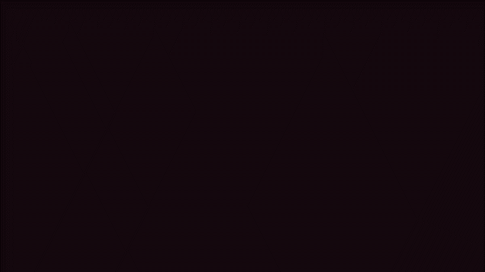
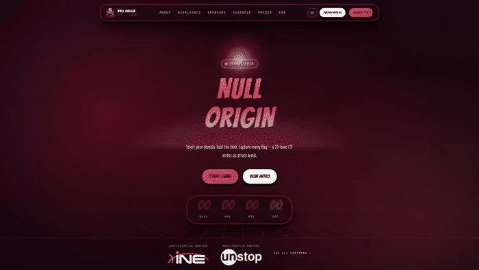

<div align="center">

# ☠️ NULL ORIGIN CTF

### The official website of the Null Origin Capture-The-Flag competition

**Hack. Exploit. Capture.** — 24 hours of online CTF in two 12-hour rounds
(Qualifier + Grand Finale) across six attack domains,
organised by **Team CyberXoX** and powered by **CyberHX**.

<br/>


</div>

---

## ✨ See it move

The site is built to feel alive. The background is a living network of red nodes —
and **your cursor is part of it**. Move the mouse and the mesh links to you and
follows you with a comet trail:



Scrolling travels through the page in real 3D — every card lies back in depth,
rises to meet you at the reading line, and tips away as it leaves:



---

## 🎯 What is this?

This is the landing page for **Null Origin CTF**, a Jeopardy-style hacking
competition. Visitors can:

- Read what the competition is and how it works
- See the **live countdown** to the event
- Try a **real sample challenge** (a ROT13 cipher — verified right on the page)
- View the **event timeline** from registration to winners
- See the **prize podium** and our partners
- **Register** their team

## 🧩 The experience, piece by piece

| Piece | What it does |
|---|---|
| **Boot intro** | Every visit opens with a cinematic terminal breach: the event name stamps in, log lines decrypt out of scrambled glyphs, a meter fills, and `ACCESS GRANTED` blows the door open into the page. Skippable instantly with a click or `Esc`. |
| **Living backdrop** | A red plexus mesh drawn on a single canvas. Nodes drift, links form and dissolve, and scrolling gently drags the whole field. Never speeds up with scroll velocity — that is what makes these effects dizzying, so this one doesn't. |
| **Cursor in the network** | The pointer is a node of the mesh itself: nearby points link to it with brighter lines and it leaves a fading comet trail. |
| **Real 3D scroll** | Every card and heading pivots continuously based on its distance from the middle of the screen. The element you are reading is always the one at zero rotation and full size — depth never costs readability. |
| **Card tilt** | Cards rotate toward the cursor in 3D with a light sweep across their surface. One delegated listener for the whole page, not one per card. |
| **Magnetic buttons** | Buttons lean a few pixels toward the cursor while hovered and spring back — capped small so the target never runs from your click. |
| **Targeting cursor** | The pointer is a thin red crosshair reticle with two broken arc rings counter-rotating around it. Over anything clickable the rig locks on: crosshair and arcs flip amber and swell. The crosshair is a real CSS cursor (zero lag, centre-accurate); only the orbit is a follower element. |
| **Details everywhere** | Countdown digits pop on every tick, the hero title fires a glitch burst every few seconds, buttons carry a shine sweep, the tab title changes when you switch away… and CTF players should probably open the console. 👀 |

> 🏴 **Warm-up flag:** there is one hidden on this site. One decode. You know which.

## 🛠️ Tech

- **React 19 + TypeScript + Vite 6** — the app itself
- **Tailwind CSS 4** — utility styling over a hand-written design system
- **Zero animation libraries** — every effect (3D scroll, mesh, tilt, intro,
  parallax) is hand-built with canvas, CSS transforms and
  `requestAnimationFrame`
- **Self-hosted fonts** — Bangers for display, Inter for reading text and
  Fira Code for terminal details, all shipped from
  `/public/fonts`, so no third-party font request and no layout shift
- **Fast** — measured at **~145 fps on desktop and ~450 fps on mobile** while
  scrolling, with every effect running

## ♿ Accessibility

- Full `prefers-reduced-motion` support: the intro, 3D, tilt, mesh motion and
  every animation switch off, and nothing that carries content is ever hidden
- Semantic landmarks, one `h1`, correct heading order, alt text on every image
- Keyboard friendly: skip-to-content link, visible amber focus rings, real
  tap-target sizes
- Text contrast at WCAG AA and above throughout

## 🚀 Run it locally

```bash
git clone https://github.com/Amansinghtomar12/NullOrigin_ShadowCopy.git
cd NullOrigin_ShadowCopy
npm install
npm run dev      # → http://localhost:3000
```

Other commands:

| Command | Purpose |
|---|---|
| `npm run build` | Production build into `dist/` |
| `npm run preview` | Serve the production build locally |
| `npm run lint` | TypeScript check |

No API keys, no environment variables — it runs out of the box.

## 📂 Where things live

```
src/
├── components/
│   ├── BootIntro.tsx        # the opening breach sequence
│   ├── CosmicBackground.tsx # the fixed backdrop (base, colour fields, grid)
│   ├── NetworkField.tsx     # the living node mesh + cursor links (canvas)
│   ├── HomeHero.tsx         # hero with countdown and parallax
│   ├── SponsorStrip.tsx     # partner band under the hero
│   └── sections/            # About, Highlights, Sponsors, Schedule,
│                            # Prizes, Closer, FAQ
├── hooks/
│   ├── useScrollDepth.ts    # the 3D scroll pose engine
│   ├── useTilt.ts           # card tilt + magnetic buttons
│   ├── useParallax.ts       # pointer/scroll parallax layers
│   ├── useCountUp.ts        # stats that count up on first view
│   └── useOperatorTouches.ts# console greeting + tab-title swap
├── constants/               # event data, partners, the sample challenge
└── index.css                # the whole design system, heavily commented
public/
├── cursors/                 # the custom red cursors
└── fonts/                   # self-hosted webfonts
```

## 🤝 Partners

| | |
|---|---|
| **INE** — In collaboration with | Certificates for our top-placing teams |
| **OffSec** — In association with | Proving Grounds Practice licences for top finishers |
| **Unstop** — Powered by | Where teams find the competition and sign up |

Want to back Null Origin? → **partners@cyberhx.com**

---

<div align="center">

Built with ❤️ by **[Aman Singh Tomar](https://github.com/Amansinghtomar12)** · Team CyberXoX

*Null Origin CTF · nullorigin.cyberhx.com*

</div>
